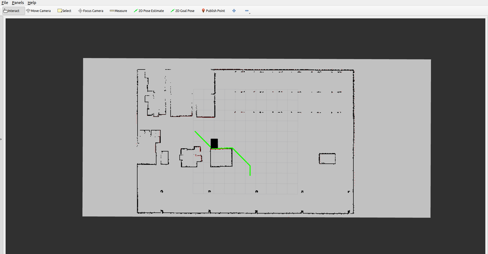

# ROS 2 Pure Pursuit Controller

A robust Pure Pursuit geometric path following controller for ROS 2, specifically designed for differential drive robots. This package integrates seamlessly with A* path planning and AMCL Lite localization to provide complete autonomous navigation capabilities.

  

## � Demo Video

Watch the Pure Pursuit controller in action with the BCR Bot:

[](https://youtu.be/olQ6hnRsmEk)

*Click the image above to watch the full demonstration video showing autonomous navigation using Pure Pursuit controller with A* path planning.*

**Video Features:**
- 🎯 Interactive goal setting via RViz 2D Goal Pose tool
- 🗺️ Real-time A* path planning on occupancy grid map
- 🚗 Smooth Pure Pursuit path following with differential drive
- � AMCL Lite particle filter localization for accurate positioning
- �📊 Live visualization of planned paths, particles, and robot trajectory
- ⚙️ Dynamic parameter tuning demonstration

---

## �🎯 Overview

The Pure Pursuit controller is a geometric path tracking algorithm that calculates steering commands to follow a given path. This implementation is optimized for differential drive robots and includes:

- **Adaptive Look-ahead Distance**: Dynamic adjustment based on robot speed
- **Differential Drive Optimization**: Rotation-in-place for sharp turns
- **A* Path Planning Integration**: Seamless connection with grid-based planners
- **AMCL Lite Localization**: Particle filter-based pose estimation for accurate navigation
- **RViz Integration**: Interactive goal setting and comprehensive visualization
- **Parameter Tuning**: Comprehensive configuration via YAML files

## 🏗️ Architecture

```
┌─────────────────┐    ┌──────────────────┐    ┌────────────────────┐
│   RViz Goal     │───▶│  A* Path Client  │───▶│  Pure Pursuit      │
│   /goal_pose    │    │                  │    │   Controller       │
└─────────────────┘    └──────────────────┘    └────────────────────┘
                                │                         │
                                ▼                         ▼
┌─────────────────┐    ┌──────────────────┐    ┌────────────────────┐
│   Map Server    │    │   A* Planner     │    │   Robot Control    │
│   /map          │    │   Action Server  │    │   /bcr_bot/cmd_vel │
└─────────────────┘    └──────────────────┘    └────────────────────┘
                                │                         ▲
                                ▼                         │
┌─────────────────┐    ┌──────────────────┐              │
│   Laser Scan    │───▶│   AMCL Lite      │──────────────┘
│   /bcr_bot/scan │    │   Localization   │ /amcl_lite_pose
└─────────────────┘    └──────────────────┘
```

## 📋 Features

### Core Functionality
- ✅ **Pure Pursuit Algorithm**: Geometric path following with configurable look-ahead
- ✅ **Differential Drive Support**: Optimized for two-wheeled robots
- ✅ **Dynamic Parameters**: Real-time tuning via ROS 2 parameters
- ✅ **Path Smoothing**: Intelligent waypoint selection for smooth motion

### Navigation Stack
- ✅ **A* Path Planning**: Grid-based optimal path planning
- ✅ **AMCL Lite Localization**: Particle filter-based robot pose estimation
- ✅ **Map Integration**: Support for occupancy grid maps
- ✅ **Goal Management**: RViz-based interactive goal setting
- ✅ **Transform Handling**: Proper coordinate frame management

### Visualization & Debugging
- ✅ **RViz Configuration**: Pre-configured visualization setup
- ✅ **Path Visualization**: Real-time path and planning display
- ✅ **Particle Visualization**: AMCL Lite particle cloud display
- ✅ **Pose Visualization**: Localized robot pose with uncertainty
- ✅ **Debug Information**: Comprehensive logging and status reporting

## 🚀 Quick Start

### Prerequisites
- ROS 2 Humble or later
- BCR Bot simulation package
- A* planner package
- ROS 2 AMCL Lite package
- Nav2 (for map server and lifecycle management)

### Installation

1. **Clone and build the package:**
```bash
cd ~/ros2_ws/src
git clone <this-repository> ros2_pure_pursuit_controller
cd ~/ros2_ws
colcon build --packages-select ros2_pure_pursuit_controller
source install/setup.bash
```

2. **Launch the robot simulation:**
```bash
ros2 launch bcr_bot ign.launch.py
```

3. **Launch the Pure Pursuit navigation system:**
```bash
ros2 launch ros2_pure_pursuit_controller pure_pursuit_sim.launch.py
```

4. **Set navigation goals:**
- Use RViz "2D Goal Pose" tool to set destination points
- Watch the robot autonomously navigate to the goal

## 📁 Package Structure

```
ros2_pure_pursuit_controller/
├── CMakeLists.txt              # Build configuration
├── package.xml                 # Package metadata
├── README.md                   # This file
├── config/
│   └── pure_pursuit_params.yaml   # Controller parameters
├── include/
│   └── ros2_pure_pursuit_controller/
│       └── pure_pursuit_controller.hpp  # Header files
├── launch/
│   └── pure_pursuit_sim.launch.py       # Complete system launch
├── rviz/
│   └── pure_pursuit_navigation.rviz     # RViz configuration
└── src/
    ├── a_star_path_client_node.cpp      # A* integration client
    ├── pure_pursuit_controller_node.cpp  # Main controller
    └── static_path_publisher_node.cpp    # Testing utility
```

## ⚙️ Configuration

### Controller Parameters (`config/pure_pursuit_params.yaml`)

```yaml
pure_pursuit_controller:
  ros__parameters:
    # Core Pure Pursuit Parameters
    look_ahead_distance: 1.0        # Base look-ahead distance (meters)
    min_look_ahead: 0.5            # Minimum look-ahead distance
    max_look_ahead: 2.0            # Maximum look-ahead distance
    
    # Speed Control
    max_linear_velocity: 0.5       # Maximum forward speed (m/s)
    max_angular_velocity: 1.0      # Maximum rotation speed (rad/s)
    
    # Differential Drive Optimization
    rotation_threshold: 0.5        # Angle threshold for rotation-in-place (rad)
    goal_tolerance: 0.2            # Distance tolerance to goal (meters)
    
    # Control Tuning
    velocity_scaling_factor: 1.0   # Velocity scaling for smooth motion
    angular_velocity_scaling: 0.8  # Angular velocity scaling factor
```

### Tuning Guidelines

| Parameter | Description | Typical Range | Effects |
|-----------|-------------|---------------|---------|
| `look_ahead_distance` | Base lookahead distance | 0.5 - 2.0m | Larger = smoother but less precise |
| `max_linear_velocity` | Maximum forward speed | 0.2 - 1.0 m/s | Higher = faster but less stable |
| `rotation_threshold` | Angle for rotation-in-place | 0.3 - 1.0 rad | Lower = more rotation behavior |
| `goal_tolerance` | Distance tolerance to goal | 0.1 - 0.5m | Smaller = more precise stopping |

## 🎮 Usage Examples

### Basic Navigation
```bash
# Launch robot simulation
ros2 launch bcr_bot ign.launch.py

# Launch navigation system
ros2 launch ros2_pure_pursuit_controller pure_pursuit_sim.launch.py

# Set goals via RViz GUI using "2D Goal Pose" tool
```

### 📸 Screenshots & Media

#### RViz Navigation Interface

*RViz interface showing the robot, map, planned path (orange), and Pure Pursuit path (green)*

#### Navigation in Action
The demo video above shows the complete navigation workflow:

1. **Map Loading**: BCR map loaded with static obstacles
2. **Goal Setting**: Click "2D Goal Pose" tool in RViz to set destination
3. **Path Planning**: A* algorithm calculates optimal path avoiding obstacles
4. **Path Following**: Pure Pursuit controller smoothly follows the planned path
5. **Goal Reaching**: Robot stops when reaching the goal within tolerance

#### Key Visual Elements:
- 🟦 **Blue Robot Model**: Current robot position and orientation
- 🟢 **Green Particles**: AMCL Lite particle cloud showing localization uncertainty
- 🔴 **Red Arrow**: Localized robot pose from AMCL Lite (`/amcl_lite_pose`)
- 🟢 **Green Path**: Pure Pursuit controller's planned trajectory (`/plan`)
- 🟠 **Orange Path**: A* planner's calculated path (`/planned_path`)
- 🗺️ **Gray Map**: Occupancy grid with obstacles (black) and free space (white)
- � **Laser Scan**: LIDAR points used for localization

### Parameter Tuning
```bash
# Real-time parameter adjustment
ros2 param set /pure_pursuit_controller look_ahead_distance 1.5
ros2 param set /pure_pursuit_controller max_linear_velocity 0.3

# View current parameters
ros2 param list /pure_pursuit_controller
ros2 param get /pure_pursuit_controller look_ahead_distance
```

### Programmatic Goal Setting
```bash
# Send goal pose via command line
ros2 topic pub /goal_pose geometry_msgs/msg/PoseStamped "
header:
  frame_id: 'map'
pose:
  position:
    x: 2.0
    y: 1.0
    z: 0.0
  orientation:
    w: 1.0"
```

## 🔧 Development & Debugging

### Building from Source
```bash
cd ~/ros2_ws
colcon build --packages-select ros2_pure_pursuit_controller --cmake-args -DCMAKE_BUILD_TYPE=Debug
source install/setup.bash
```

### Debugging Tips
1. **Check topic connections:**
   ```bash
   ros2 topic list
   ros2 topic echo /plan
   ros2 topic echo /amcl_lite_pose
   ros2 topic echo /bcr_bot/cmd_vel
   ```

2. **Monitor AMCL Lite localization:**
   ```bash
   ros2 topic echo /amcl_lite_particles
   ros2 node info /amcl_lite_node
   ```

3. **Monitor node status:**
   ```bash
   ros2 node list
   ros2 node info /pure_pursuit_controller
   ```

4. **View transforms:**
   ```bash
   ros2 run tf2_tools view_frames
   ros2 run tf2_ros tf2_echo map odom
   ```

### Common Issues & Solutions

| Issue | Cause | Solution |
|-------|-------|----------|
| Robot not moving | No localized pose | Check AMCL Lite is running and receiving laser data |
| Poor localization | Insufficient particles | Set initial pose in RViz with 2D Pose Estimate |
| Path planning fails | No start pose | Ensure AMCL Lite is publishing to `/amcl_lite_pose` |
| Jerky motion | Look-ahead too small | Increase `look_ahead_distance` |
| Overshooting goals | High speed/low tolerance | Reduce `max_linear_velocity` or decrease `goal_tolerance` |
| Map not visible | QoS mismatch | Verify map server is running |


## 📄 License

This project is licensed under the MIT License - see the [LICENSE](LICENSE) file for details.

## 🙏 Acknowledgments

- **ROS 2 Community** for the excellent robotics framework
- **Nav2 Project** for navigation stack inspiration
- **Pure Pursuit Algorithm** researchers for the foundational work

## 🔗 Related Packages

- [bcr_bot](https://github.com/blackcoffeerobotics/bcr_bot) - Robot simulation package
- [a_star_planner](https://github.com/ayusefi/a_star_planner) - Grid-based path planning
- [ros2_amcl_lite](https://github.com/ayusefi/ros2_amcl_lite) - Lightweight particle filter localization

---